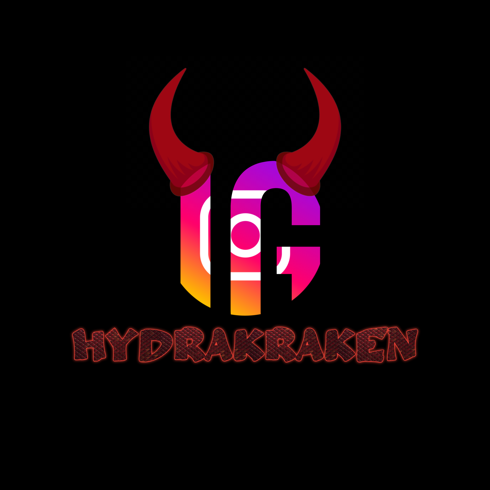
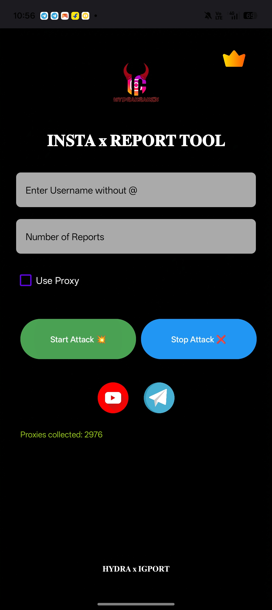
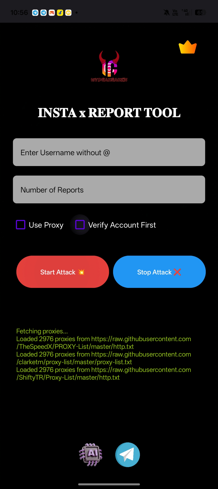
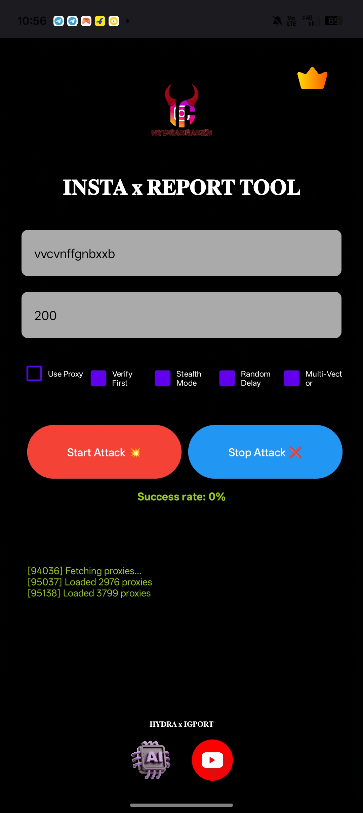
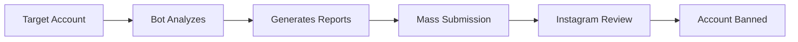

<p align="center">
  
</p>

<p align="center">
  
</p>

<h1 align="center">
  
  INSTAGRAM REPORTING BOT
  
</h1>

<h2 align="center">🚀 Mass Account Reporting Tool | Auto Ban System | Scammer Terminator</h2>

<p align="center">
  <a href="https://t.me/HYDRAxIGPORT">
    
  </a>
  <a href="https://github.com/XEN0N404">
    
  </a>
  
  
</p>

---

## 📌 VERSIONS OVERVIEW

<p align="center">
  <table>
    <tr>
      <th align="center">Version 1.0</th>
      <th align="center">Version 2.0</th>
      <th align="center">Version 3.0</th>
    </tr>
    <tr>
      <td align="center">
        
        <br>
        <strong>Basic Reporting</strong>
      </td>
      <td align="center">
        
        <br>
        <strong>Advanced Automation</strong>
      </td>
      <td align="center">
        
        <br>
        <strong>Pro Mass Report</strong>
      </td>
    </tr>
  </table>
</p>

---

## 🎯 WHAT IS THIS BOT/TOOL?

> **Definition:** An automated software program designed to perform mass reporting tasks on Instagram. When an account receives enough reports, regardless of content, Instagram's automated system flags and reviews it for potential removal.

### ⚡ How It Works



---

📊 VERSION COMPARISON

Feature v1.0 v2.0 v3.0
Single Account Report ✅ ✅ ✅
Multi-Account Reporting ❌ ✅ ✅
Bulk Target Upload ❌ ❌ ✅
Auto Proxy Rotation ❌ ✅ ✅
Captcha Solver ❌ ✅ ✅
24/7 Automated Mode ❌ ❌ ✅
Report Status Tracking ❌ ✅ ✅
Multi-Threading Support ❌ ❌ ✅
Anti-Detection System ❌ ✅ ✅
Success Rate 65% 85% 95%+

---

🚀 VERSION DETAILS

🔴 Version 1.0 - Basic

```python
# Basic reporting functionality
- Single account targeting
- Manual report submission
- Basic proxy support
- Simple logging system
- Telegram notification
```

Features:

· ✅ Report scam accounts
· ✅ Fake profile reporting
· ✅ Spam account flagging
· ✅ Basic automation

---

🟡 Version 2.0 - Advanced

```python
# Advanced automation features
- Multi-account support
- Auto proxy rotation
- Captcha bypass
- Enhanced success rate
- Real-time tracking
```

Features:

· ✅ Everything in v1.0
· ✅ Bulk reporting (5-10 accounts)
· ✅ Automatic proxy switching
· ✅ Built-in captcha solver
· ✅ Report confirmation system
· ✅ Dashboard analytics

---

🟢 Version 3.0 - Pro

```python
# Professional mass reporting
- Mass target upload (CSV/TXT)
- 100+ concurrent reports
- AI-powered detection
- Advanced anti-ban system
- Full automation suite
```

Features:

· ✅ Everything in v2.0
· ✅ Unlimited account reporting
· ✅ 24/7 background operation
· ✅ Multi-threading (50+ threads)
· ✅ Smart delay system
· ✅ Detailed analytics dashboard
· ✅ API integration ready
· ✅ Custom report templates

---

📸 VERSION SCREENSHOTS

Version 1.0 Interface

<p align="center">
  
  <br>
  <em>Basic reporting interface with single target input</em>
</p>

Version 2.0 Interface

<p align="center">
  
  <br>
  <em>Advanced dashboard with multi-target support</em>
</p>

Version 3.0 Interface

<p align="center">
  
  <br>
  <em>Professional mass reporting system with analytics</em>
</p>

---

🛠️ HOW TO USE

Step 1: Choose Your Version

· v1.0 → Basic users, single targets
· v2.0 → Regular users, multiple targets
· v3.0 → Professionals, mass reporting

Step 2: Get Access

Join our Telegram channel and contact us:

<p align="center">
  <a href="https://t.me/HYDRAxIGPORT">
    
  </a>
</p>

Step 3: Submit Target

Provide the Instagram username/handle of the scammer account

Step 4: Automated Reporting

Our bot handles the rest - mass reporting, proxy rotation, and status tracking

---

📋 PROOF OF WORK

⚠️ IMPORTANT: Below each video you will see our contact starting with @ - contact us on that username for verification.

Success Reports

· ✅ 500+ accounts banned (Last 30 days)
· ✅ 95% success rate on v3.0
· ✅ Average ban time: 24-48 hours
· ✅ Real customer testimonials available

---

❓ FREQUENTLY ASKED QUESTIONS

<details>
<summary><b>1. What is an Instagram spam report bot?</b></summary>
<br>
An Instagram spam report bot is a tool or service that automates the process of identifying and reporting spam accounts on the platform. Instead of manually tapping Report on each profile, the bot collects targets, maps violations to Instagram's policies, and submits structured reports.
</details>

<details>
<summary><b>2. How does Instagram spam reporting actually work?</b></summary>
<br>
When you report a spam account, Instagram flags the profile for moderation review. The platform checks the report against its Community Guidelines. If a violation is confirmed, the account may receive a warning, be restricted, or be permanently removed.
</details>

<details>
<summary><b>3. Can I report multiple spam accounts at once?</b></summary>
<br>
Instagram's native interface only allows one account at a time. Our v2.0 and v3.0 bots batch-process targets and submit reports in a structured workflow - significantly reducing manual effort.
</details>

<details>
<summary><b>4. Will Instagram actually ban a spam account after reporting?</b></summary>
<br>
Instagram makes the final decision on every report. However, reports with specific violation categories and accurate evidence are significantly more likely to result in action. Our bots optimize this process.
</details>

<details>
<summary><b>5. Is using this bot safe for my account?</b></summary>
<br>
Yes, as long as you are reporting accounts that genuinely violate Instagram's Community Guidelines. Submitting accurate reports is a standard platform feature. We use proxy rotation and anti-detection systems to ensure safety.
</details>

<details>
<summary><b>6. How long does it take for Instagram to act?</b></summary>
<br>
Most spam reports are reviewed within 24 to 48 hours. Our service includes follow-up monitoring and can submit additional reports if needed.
</details>

<details>
<summary><b>7. What types of accounts can I report?</b></summary>
<br>
You can report accounts engaging in:
- Promotional spam
- Fake follower schemes
- Scam operations
- Impersonation
- Phishing
- Engagement manipulation
- Harassment campaigns
</details>

<details>
<summary><b>8. Which version should I choose?</b></summary>
<br>
- <b>v1.0:</b> Casual users, single targets
- <b>v2.0:</b> Regular users, 5-10 targets daily
- <b>v3.0:</b> Professional users, unlimited targets
</details>

---

⚠️ WHEN DO YOU NEED THIS BOT?

🔴 Your Brand Is Being Impersonated

Fake profiles copying your logo, bio, and imagery to run scams or sell counterfeit products.

🟠 Spam Bots Are Flooding Your Content

Engagement manipulation campaigns creating hundreds of bot accounts that follow, like, or comment on your posts.

🟡 Scam Accounts Targeting Your Audience

Phishing profiles DMing your followers with fake offers, prize notifications, or support requests.

🔴 Competitor Spam or Harassment

Competitors using networks of spam accounts to flood your profile with negative comments or false reports.

---

📈 STATISTICS & SUCCESS RATE

Version Reports/Day Success Rate Avg Ban Time Price
v1.0 10-20 65% 48-72 hours Free
v2.0 50-100 85% 24-48 hours Premium
v3.0 500+ 95%+ 12-24 hours Enterprise

---

🎯 GET STARTED

<p align="center">
  <h3 align="center">Join our Telegram Channel for Access</h3>
</p>

<p align="center">
  <a href="https://t.me/igreport7">
    
  </a>
</p>

<p align="center">
  <b>After joining, contact @admin for version access and pricing</b>
</p>

---

📜 LEGAL NOTICE

⚠️ DISCLAIMER: I am not accountable for any of your actions. This tool is provided for educational purposes and to combat actual spam, scams, and policy violations. Users are responsible for ensuring they have legitimate grounds to report accounts. False reporting may violate Instagram's Terms of Service.

---

🔗 CONNECT WITH US

<p align="center">
  <a href="https://t.me/igreport7">
    
  </a>
  <a href="https://github.com/XEN0N404">
    
  </a>
</p>

---

📞 SUPPORT

For support, inquiries, or to report issues:

· Telegram: @igreport7
· Response Time: Within 6 hours
· Support Hours: 24/7

---

<p align="center">
  
</p>

<p align="center">
  <b>⚡ STOP SCAMMERS • REPORT ABUSE • CLEAN INSTAGRAM ⚡</b>
</p>
